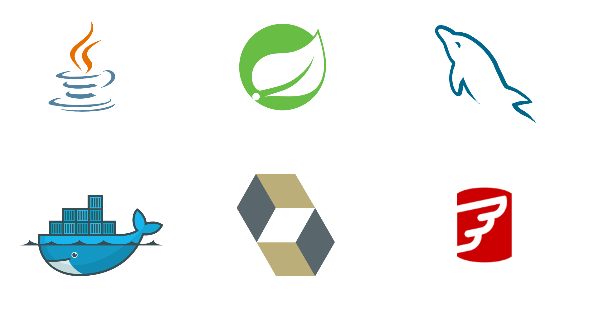
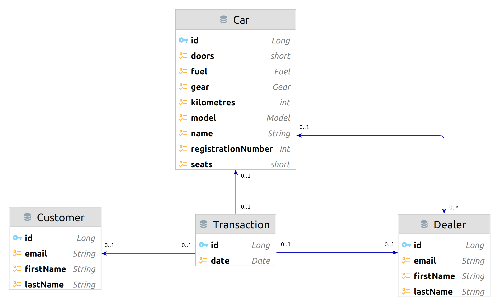

# _Rental Car Agency_

***
**_`السَّلامُ عَلَيْكُم ورَحْمَةُ اللهِ وَبَرَكاتُهُ`_** <br/>

**_`Assalaam-Alaikum`_** <br/>

Welcome to the Rental Car Agency application! This is a REST API service built with the Spring Boot framework, <br>
that allows you to perform CRUD operations on a car rental database. <br/>
This application is designed to demonstrate how to build a simple Spring Boot application that interacts with a MySQL
database and provides RESTful endpoints for client-side communication. <br/>



* [_Rental Car Agency_](#rental-car-agency)
    * [_Technologies Used_](#technologies-used)
    * [_Requirements_](#requirements)
    * [_Installation_](#installation)
    * [_Architecture_](#architecture)
    * [_Endpoints_](#endpoints)
    * [_Knowledge gained_](#knowledge-gained)
    * [_Contributing_](#contributing)
    * [_License_](#license)

## _Technologies Used_

The following technologies were used to build this application: <br/>
✅ Java 21   <br/>
✅ Spring Boot 3 <br/>
✅ Spring Data JPA <br/>
✅ MySQL <br/>
✅ Flyway <br/>
✅ JUnit <br/>
✅ Mockito <br/>
✅ Maven <br/>
✅ IntelliJ IDEA <br/>
✅ Postman <br/>

## _Requirements_

* Having **Java 21** or later installed. <br>
  You can download it
  from [Oracle's website](https://www.oracle.com/java/technologies/downloads/#java21).


* Having MySQL DataBase installed, or you can fire up an instance of MySQL using the docker-compose file provided in the
  project. <br>
  Install **MySQL** from [MySQL's website](https://dev.mysql.com/downloads/mysql/).


* Having a Client-Side application to communicate with the REST API endpoints. <br>
  Install **Postman** from [Postman's website](https://www.postman.com/downloads/).

## _Installation_

1. Clone this repository to your local machine using this
   command : <br/> `git clone https://github.com/NidhalNaffati/Rental-Car-Agency.git`
2. Import the project into your IDE (such as IntelliJ IDEA or Eclipse).
3. Open the `application.yml` file located in `src/main/resources/` and update the database credentials with your own.

  ```yaml
spring:
  datasource:
    url: jdbc:mysql://localhost:3306/RentalCarDB?createDatabaseIfNotExist=true
    username: MYSQL_USERNAME
    password: MYSQL_PASSWORD
```

4. Run the application as a Spring Boot application, or using the Maven plugin `mvn spring-boot:run`.

## _Architecture_



## _Endpoints_

After running the application, you can use Postman to communicate with the REST API endpoints.
Each endpoint expects a specific input format and returns a specific output format.
If you want to test it out in Postman, you can import the collections located in `src/test/postman/`

The following endpoints are available in the API:

| HTTP Method | Endpoint                                               | Request Body | Response Body | Description                                                             |
|:-----------:|--------------------------------------------------------|:------------:|:-------------:|-------------------------------------------------------------------------|
|   `POST`    | `/api/v1/cars`                                         |    `Car`     |     `Car`     | Create a new car                                                        |
|    `PUT`    | `/api/v1/cars/{id}`                                    |    `Car`     |     `Car`     | Update an existing car by `id`                                          |
|  `DELETE`   | `/api/v1/cars/{id}`                                    |      -       |       -       | Delete an existing car by `id`                                          |
|    `GET`    | `/api/v1/cars/{id}`                                    |      -       |     `Car`     | Get an existing car by `id`                                             |
|    `GET`    | `/api/v1/cars`                                         |      -       |  `List<Car>`  | Get a list of all cars                                                  |
|    `GET`    | `/api/v1/cars?registrationNumber={registrationNumber}` |      -       |     `Car`     | Get a car by `registrationNumber`                                       |
|    `GET`    | `/api/v1/cars?carName={carName}`                       |      -       |  `List<Car>`  | Get a list of cars by `carName`                                         |
|    `GET`    | `/api/v1/cars?model={model}`                           |      -       |  `List<Car>`  | Get a list of cars by `model`                                           |
|    `GET`    | `/api/v1/cars?kilometre={kilometre}&lesser`            |      -       |  `List<Car>`  | Get a list of cars with kilometres lesser than or equal to `kilometre`  |           |
|    `GET`    | `/api/v1/cars?kilometre={kilometre}&greater `          |      -       |  `List<Car>`  | Get a list of cars with kilometres greater than or equal to `kilometre` |

<br/>

| HTTP Method | Endpoint                         | Request Body |  Response Body   | Description                         |
|:-----------:|----------------------------------|:------------:|:----------------:|-------------------------------------|
|   `POST`    | `/api/v1/customers`              |  `Customer`  |    `Customer`    | Create a new customer               |
|    `PUT`    | `/api/v1/customers/{id}`         |  `Customer`  |    `Customer`    | Update an existing customer by `id` |
|  `DELETE`   | `/api/v1/customers/{id}`         |      -       |        -         | Delete an existing customer by `id` |
|    `GET`    | `/api/v1/customers/{id}`         |      -       |    `Customer`    | Get an existing customer by `id`    |
|    `GET`    | `/api/v1/customers`              |      -       | `List<Customer>` | Get a list of all customers         |
|    `GET`    | `/api/v1/customers?name={email}` |      -       |    `Customer`    | Get a customer by `email`           |
|    `GET`    | `/api/v1/customers?name={name}`  |      -       | `List<Customer>` | Get a list of customers by `name`   |

<br/>

| HTTP Method | Endpoint                       | Request Body | Response Body  | Description                       |
|:-----------:|--------------------------------|:------------:|:--------------:|-----------------------------------|
|   `POST`    | `/api/v1/dealers`              |   `Dealer`   |    `Dealer`    | Create a new Customer             |
|    `PUT`    | `/api/v1/dealers/{id}`         |   `Dealer`   |    `Dealer`    | Update an existing dealer by `id` |
|  `DELETE`   | `/api/v1/dealers/{id}`         |      -       |       -        | Delete an existing dealer by `id` |
|    `GET`    | `/api/v1/dealers/{id}`         |      -       |    `Dealer`    | Get an existing dealer by `id`    |
|    `GET`    | `/api/v1/dealers`              |      -       | `List<Dealer>` | Get a list of all dealers         |
|    `GET`    | `/api/v1/dealers?name={email}` |      -       |    `Dealer`    | Get a dealers by `email`          |
|    `GET`    | `/api/v1/dealers?name={name}`  |      -       | `List<Dealer>` | Get a list of dealers by `name`   |

<br/>

| HTTP Method | Endpoint               | Request Body  |    Response Body    | Description                    |
|:-----------:|------------------------|:-------------:|:-------------------:|--------------------------------|
|   `POST`    | `/api/v1/transactions` | `Transaction` |    `Transaction`    | Create a new Transaction       |
|    `GET`    | `/api/v1/transactions` |       -       | `List<Transaction>` | Get a list of all transactions |

## _Knowledge Gained_

In this project, I learned how to build a REST API using Spring Boot and how to use Spring Data JPA to interact with a
MySQL database.

* Spring Boot 3 basics and how to use it to build a REST API.
* Following the RESTful API design principles.
* Using Spring Data JPA to interact with a MySQL database.
* Flyway for database migrations.
* Server and Client Side Error Handling.
* Validating user inputs or JSON object using Spring Boot Validation.
* Unit Testing using JUnit and Mockito.
* Integration Testing using Spring Boot Test.
* Dealing with Data using Spring Data JPA.
    * Fetching data using a GET api.
    * Sending data from a FORM using a POST api.
    * Editing an existing object using a PUT api
    * Deleting an existing product using a DELETE api

## _Contributing_

1. Fork this repository to your GitHub account.
2. Clone the forked repository to your local machine.
3. Create a new branch for your changes.
4. Make your changes and commit them with descriptive commit messages.
5. Push your changes to your GitHub account.
6. Create a pull request from your branch to the original repository's main branch.
7. Wait for the maintainers to review and merge your changes.

When making contributions, please keep the following in mind:

* Follow the code style and formatting guidelines used in the project.
* Write clear and concise commit messages that explain the changes you made.
* Make sure your changes do not break existing functionality.
* Write tests for new code and ensure that all existing tests pass.

## _License_

You are allowed to use, copy, modify, and distribute the code freely, just don't create a bomb or something like that xD
